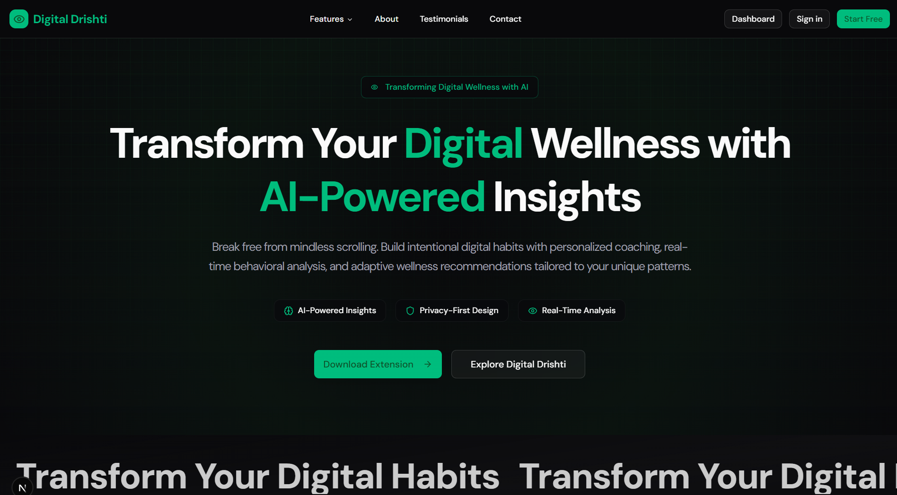
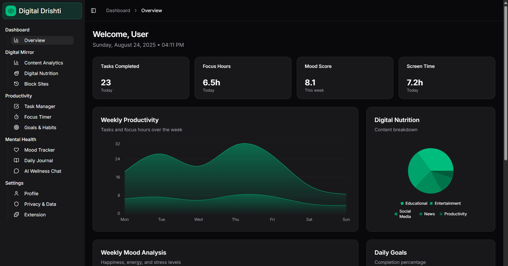

# 🧠 Digital Drishti

> Transform your digital wellness with AI-powered insights and mindful technology habits.

## What is Digital Drishti?

Digital Drishti helps you build a healthier relationship with technology. Break free from mindless scrolling and develop intentional digital habits through intelligent insights and personalized wellness coaching.

## ✨ Features

- 🤖 **AI-Powered Analysis** - Smart insights into your digital behavior
- 👁️ **Real-Time Awareness** - Instant feedback on browsing habits  
- 🛡️ **Privacy First** - Your data stays secure and private
- 📊 **Beautiful Analytics** - Visualize your progress with charts
- 🎯 **Smart Goals** - Achieve personalized wellness targets

## 📊 Dashboard

Track your digital wellness journey with comprehensive analytics, focus scores, and personalized recommendations.

## 🚀 How It Works

1. **Install** Chrome extension
2. **Browse** normally while we track patterns
3. **Analyze** your digital behavior with AI
4. **Improve** with personalized insights and gentle reminders

## 🎯 Perfect For

- Students balancing study and breaks
- Remote workers maintaining focus
- Anyone reducing screen addiction
- Families building healthy digital habits

## 🔮 Coming Soon

- Mobile app companion
- Sleep impact analysis
- Team workplace analytics
- Smart break reminders

## 🤝 Contributing

Contributions welcome! Fork the repo, create a feature branch, and submit a pull request.

---

**Made with ❤️ for digital wellness**